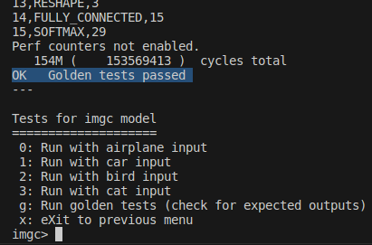

# Final Project: MLPerf™ Tiny


## Introduction
----
In the final project, you are required to design a CFU for MLPerf™ Tiny image classification benchmark model and targeting on decreasing latency.  

Also, Your design will be benchmarked by the MLPerf™ Tiny Benchmark Framework. Here is its [Github page](https://github.com/mlcommons/tiny) for detailed information aboud MLPerf™ Tiny.

### Selected Model

We use [MLPerf™ Tiny Image Classification Benchmark Model](https://github.com/mlcommons/tiny/tree/master/benchmark/training/image_classification) for the project. It is a tiny version of ResNet, consisting of Conv2D, Add, AvgPool2D, FC, and Softmax.

You don't need to integrate the model on yourself. The model is already included in CFU. See `${CFU_ROOT}/common/src/models/mlcommons_tiny_v01/imgc/`. Also, you can inspect the architecture of the selected model with [Netron](https://netron.app/). It might provide you some inspiration for your design.

## Setup
----
Clone the fork of final project to get the final project template
```
$ git clone https://github.com/nycu-caslab/AAML2024-project.git
```
Final project template path: `${CFU_ROOT}/proj/AAML_final_proj`
- Dependency (python): pyserial, tdqm 

## Requirements
----
### Files
You can modify the following files:
* Kernel API
    1. `tensorflow/lite/micro/kernels/add.cc`
    2. `tensorflow/lite/micro/kernels/conv.cc`
    3. `tensorflow/lite/micro/kernels/fully_connected.cc`
    4. `tensorflow/lite/micro/kernels/softmax.cc`
    5. `tensorflow/lite/micro/kernels/pooling.cc`

* Kernel Implementation
    1. `tensorflow/lite/kernels/internal/reference/integer_ops/add.h`
    2. `tensorflow/lite/kernels/internal/reference/integer_ops/conv.h`
    3. `tensorflow/lite/kernels/internal/reference/integer_ops/fully_connected.h`
    4. `tensorflow/lite/kernels/internal/reference/integer_ops/softmax.h`
    5. `tensorflow/lite/kernels/internal/reference/integer_ops/pooling.h`

* HW design
    1. `cfu.v`

```{important}
No other source code in `${CFU_ROOT}/common/**` and `${CFU_ROOT}/third_party/**` should be overriden unless asking for permission.
```

### Golden Test
Secondly, your design should pass the golden test. 
* After `make prog && make load`, input `11g` to run golden test of MLPerf Tiny imgc model. The result should be like:  


### Architecture
You can also modify the architecture or the parameters of the selected model. The classification accuracy of your design is evaluated.

However, **DO NOT RETRAIN THE MODEL ON TESTING IMAGES**.

### Performance
We use the evaluation script to evaluate your design.

* Usage:
    * `make prog && make load` > reboot litex > turn off litex-term > run eval script
    * `python eval_script.py` in `${CFU_ROOT}/proj/AAML_final_pro`
        * `--port {tty_path:-/dev/ttyUSB1}`: Add this argument to select correct serial port

The result should be like:  


Improve the performance of your design to decrease the latency as low as it could be.

```{note}
If you just want to know the latency of your design, it would be easier to run a test input instead of whole process of evaluation.
```

## Presentation - 30%
----
```{important}
You will receive 0 point if you don't present your work
```
- The presentation takes 30% of your final project score.
- You should give a presentation in the last class of this semester
- Each team has 5 minutes to present at most
- Your presentation should contains
    - The introduction of your design
        - SW
        - HW
    - (Optional) The implementation of your design
        - SW
        - HW
    - The evaluation of your design
        - Accuracy (if you modify the selected model)
        - Latency

## Grading Policy
----
- We will compare the performance of your design with our reference design (simply the SIMD in lab 2) and will not be released.
- ACC won't be tested if you didn't modify the model
- TA's latency:
\begin{gather}
\begin{aligned}
\text{LAT}_{TA} \approx 154M \ \text{cycles} \approx 2036000 \ \mu s
\end{aligned}
\end{gather}

- Latency and accuracy will be measured by the provided evaluation script (the following is the original performance).

    

- Ranking will be released with everyone's evaluation result after the deadline.

## Grading Formula
----
- Accuracy:
\begin{gather*}
\text{GOLD} = \begin{cases}
1 & \text{if golden test passed,} \\
0 & \text{if golden test failed}
\end{cases}
\end{gather*}

\begin{gather*}
\text{ACC} = \min \left( \frac{\text{ACC}_{\text{student}}}{\text{ACC}_{\text{original}}}, 100\% \right)
\end{gather*}

```{important}
Note that better ACC won't give you better score!!
```

- Latency
:


\begin{gather*}
\text{LAT}_{\text{base}} = \min \left( 80 \times \frac{\text{LAT}_{\text{TA}}}{\text{LAT}_{\text{student}}}, 80 \right)
\end{gather*}

\begin{gather*}
\text{LAT}_{\text{rank}} = \min \left( 20 \times \frac{\#\text{students} - \text{Rank}_{\text{student}}}{\#\text{students}}, 20 \right) \\
\text{where } \text{Rank}_{\text{student}} \in [0, \#\text{students} - 1]
\end{gather*}

- Presentation

\begin{gather*}
\text{Present} = 
\begin{cases} 
    -30 & \text{if you submit a plain impl of lab2 with the same performance as TA's,} \\
    0 & \text{otherwise} 
\end{cases}
\end{gather*}

- Final score:
\begin{gather*}
\text{Score} = GOLD \times ACC \times (LAT_{base} + LAT_{rank}) + \text{Present} \\
\text{(Highest score} = 1 \times 100\% \times (80 + 20) - 0 = 100)
\end{gather*}

## Submission
----
Please fork the repo and push your work to it
- If you use your own model:
    - Put pretrained model under `${CFU_ROOT}/proj/AAML_final_proj` or somewhere else we can easily find it
    - Put your training script in your final project repo and leave a message about where to find them in the README.md under your CFU project direcrtory

- Grading workflow will be:
    - Clone your fork
    - Apply your custom model if needed
    - `make prog && make load`
    - Run golden test
    - Run evaluation script
    - Record measurements
